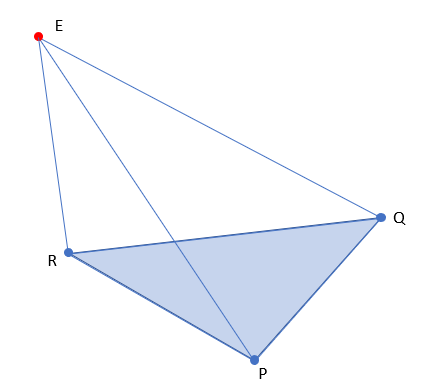
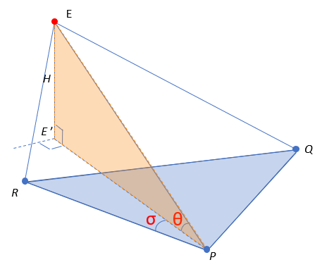
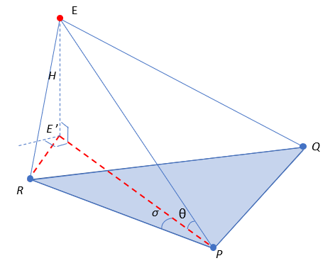
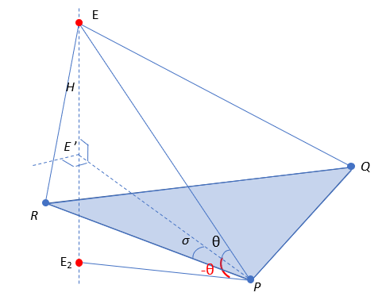

# tetrahedron-4th-vertex
Demonstration of finding the 4th vertex of a tetrahedron given its base and distances to vertex

## Problem definition

Consider a [Tetrahedron](https://mathworld.wolfram.com/Tetrahedron.html) in the regular  cartesian space defined by: 

- Points _P_, _Q_ and _R_
- Distances ,  and  from the respectives points _P_, _Q_ and _R_ to the unknown 4th vertex _E_

The problem consists on finding the (_x_, _y_, _z_) coordinates of the point _E_.

## Solution

Although there are other solutions using intersections of spheres or planes, this problem can be solved by regular trigonometric approach. 

Note that θ is the angle between the unknow vector  and the plane defined by the points _P_, _Q_ and _R_. σ is the angle between the projection of  on the same plane _PQR_ and the vector .

As the image suggests, σ and θ can be obtained in a straightforward way from the tetrahedron height and elementary trigonometric properties, as shown below.

## Finding  angles σ and θ

1) Find the tetrahedron _Volume_ using [Calyer-Menger determinant](https://mathworld.wolfram.com/Cayley-MengerDeterminant.html):

<a href="https://www.codecogs.com/eqnedit.php?latex=288&space;Volume^2&space;=&space;\left|\begin{matrix}0&space;&&space;1&space;&&space;1&space;&&space;1&space;&&space;1\cr&space;1&space;&&space;0&space;&&space;||\vec{RE}||^{2}&space;&&space;||\vec{PE}||^{2}&space;&&space;||\vec{QE}||^{2}\cr&space;1&space;&&space;||\vec{RE}||^{2}&space;&&space;0&space;&&space;\tilde||\vec{QE}||^{2}&space;&&space;\tilde||\vec{PE}||^{2}\cr&space;1&space;&&space;||\vec{PE}||^{2}&space;&&space;\tilde||\vec{QE}||^{2}&space;&&space;0&space;&&space;\tilde||\vec{RE}||^{2}\cr&space;1&space;&&space;||\vec{QE}||^{2}&space;&&space;\tilde||\vec{PE}||^{2}&space;&&space;\tilde||\vec{RE}||^{2}&space;&&space;0\end{matrix}\right|" target="_blank"></a>

2) Find the _Area_ of triangle _P_, _Q_, _R_ using [Heron's formula](https://mathworld.wolfram.com/HeronsFormula.html):

^2})

3) Find the tetrahedron height _H_ using the relationship between _Volume_ and _Area_:

4) Find θ:

)

Once we have θ the next step is to find the length of the projections  and  onto the plane defined by _P_, _Q_ and _R_:

5) Thus, using the [Law of Cosines](https://mathworld.wolfram.com/LawofCosines.html), σ is given by:

Once we have _P_, , σ and θ we know everything we need to find _E_.

## Finding _E_ given σ, θ, _P_ and 

There are several ways to obtain _E_(_x_, _y_, _z_), one of them is rotating  by σ and then rotating again by θ, as demonstrated below.

1) Find the _PQR_ triangle normal :

2) Rotate  about  by -σ using [Rodrigues' formula](https://mathworld.wolfram.com/RodriguesRotationFormula.html):

3) Find the normal  from  and :

4) Rotate  by -θ about :

5) Get the unit vector from  and multiply it by  in order to obtain :

Finally, _E_ is given by

It is noteworthy that the symmetric solution  can be find by rotating  about  by +θ (instead of -θ):

## Different approaches

This same problem can be solved by finding the intersection of the 3 spheres centered on _P_, _Q_ and _R_ and respective radius ,  and .

Another approach is by finding the intersection of planes _PER_, _PQE_ and _REQ_.

## Future work

One of my future work is checking out if this approach is less computational intensive than others.

## Acknowledgements

I would like to thanks to github markup team for not provide a simple way to write math expressions on markdown documents. Thus, in order to provide the formulas I ended up using this formula image generator: https://www.codecogs.com/latex/eqneditor.php. For more details see https://github.com/github/markup/issues/897.